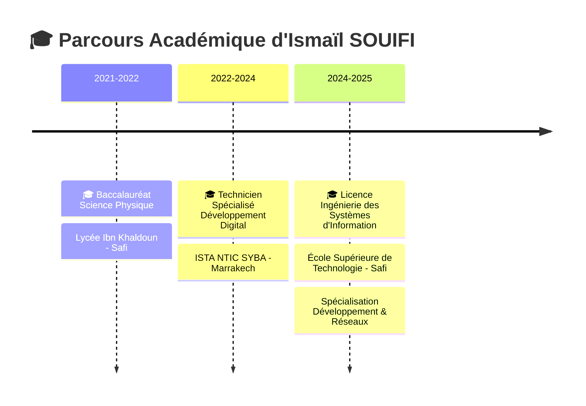

# 🌟 SOUIFI ISMAIL

<div align="center">
  


[](https://git.io/typing-svg)

<div align="center">
  <a href="mailto:souifiismail@gmail.com">
    
  </a>
  <a href="https://linkedin.com/in/ismail-souifi-90aa5b277/">
    
  </a>
  <a href="tel:+212602079775">
    
  </a>
</div>

<br>


</div>

## 🎯 À Propos de Moi


```typescript
const ismailSouifi = {
  🎓 formation: "Licence Ingénierie Systèmes d'Information",
  🏫 ecole: "École Supérieure de Technologie - Safi",
  📍 localisation: "Marrakech, Maroc 🇲🇦",
  💼 statut: "Étudiant Ingénieur & Développeur",
  🔭 actuellement: "Recherche d'opportunités professionnelles",
  🌱 apprentissage: ["Intelligence Artificielle", "Big Data", "Cloud Computing"],
  💬 expertises: ["Développement Web", "IA", "Gestion de Projets"],
  ⚡ passion: "Transformer les idées en solutions innovantes",
  🎯 objectif: "Contribuer à des projets technologiques d'impact"
};
```

<br clear="right"/>

## 🛠️ Arsenal Technologique

###  Langages de Programmation

<div align="center">


</div>

###  Frontend Development

<div align="center">


</div>

###  Backend Development

<div align="center">


</div>

###  Bases de Données

<div align="center">


</div>

###  Intelligence Artificielle & Big Data

<div align="center">


</div>

###  Outils & Méthodologies

<div align="center">


</div>

<br>


## 📊 Statistiques GitHub

<div align="center">
  


</div>

## 🏆 Trophées GitHub

<div align="center">
  
</div>

<br>

## 🚀 Projets Remarquables

<div align="center">

### 🤖 Plateforme Intelligente de Gestion de Stagiaires


**Solution complète avec matching intelligent IA, génération automatique de certificats QR Code**

---

### 🏥 Assistant Médical Intelligent


**Application d'assistance médicale avec IA pour analyse automatique des symptômes**

---

### 📊 Entrepôt de Données Hôtelier avec BI


**Data warehouse avec processus ETL et tableaux de bord interactifs Power BI**

---

### 🌱 Simulateur de Potager Intelligent


**Application de simulation agricole avec gestion automatisée complète**

</div>

<br>


## 🎓 Formation Académique

<div align="center">


</div>


## 🌍 Langues

<div align="center">


</div>

## 🎯 Objectifs 2025

<div align="center">

```typescript
const objectifs2025 = {
  🎯 carriere: "Décrocher un poste en développement full-stack",
  📚 apprentissage: ["Cloud AWS/Azure", "DevOps", "Microservices"],
  🏆 certifications: ["AWS Solutions Architect", "Scrum Master"],
  🚀 projets: ["Application mobile React Native", "API GraphQL"],
  🌟 impact: "Contribuer à des projets open-source",
  🤝 collaboration: "Rejoindre une équipe tech innovante"
};
```

</div>

<br>


## 💫 Citation Inspirante

<div align="center">
  


</div>

---

<div align="center">

### 🌟 "Transformer les idées en réalité technologique" 🌟


**💡 Prêt à collaborer sur des projets innovants ! 💡**

</div>
